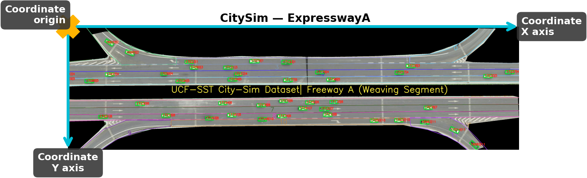
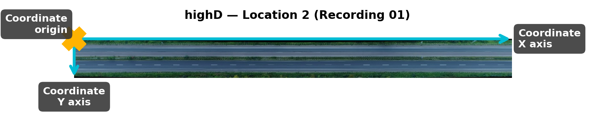
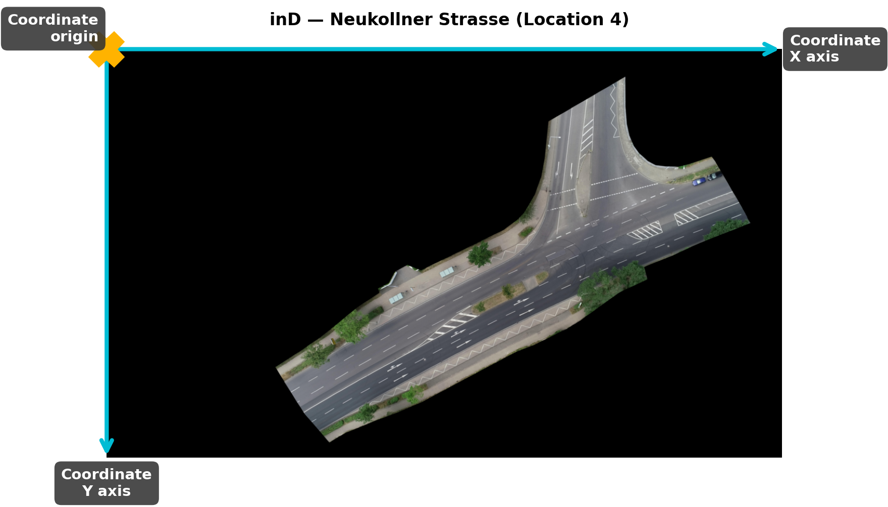
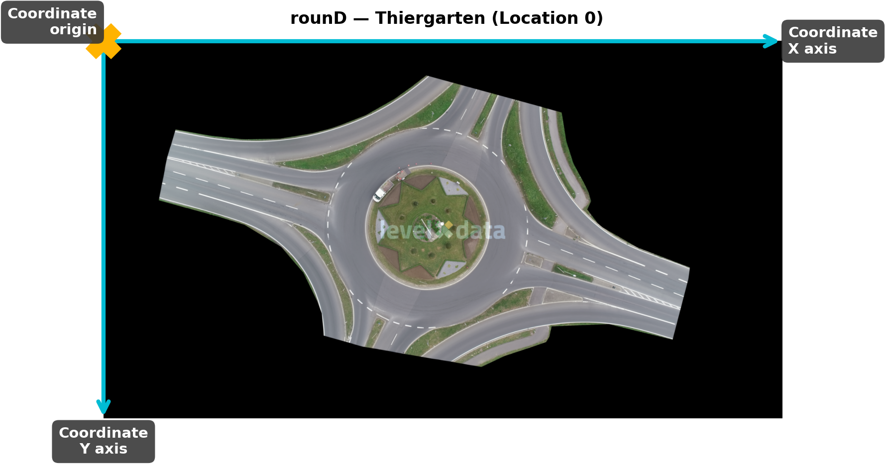
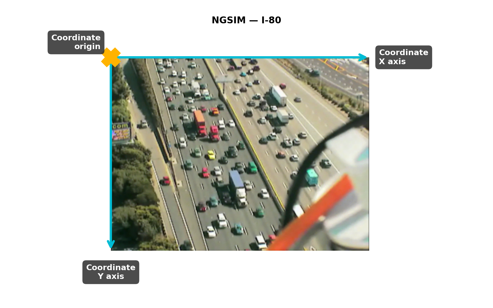

# Dataset Metadata

This document organizes the **Meta Data** and **Intermediate Variables** for 5 trajectory datasets (CitySim, highD, inD, rounD, NGSIM). Format reference: [TrajectoryDataFormat Wiki](https://github.com/ZhilingResearch/Ozone/wiki/TrajectoryDataFormat).

---

## 1. CitySim

**Application Page**: https://github.com/UCF-SST-Lab/UCF-SST-CitySim1-Dataset

**Data Source**: University of Central Florida (UCF), USA / Partner universities (Southwest Jiaotong University, Southeast University, Hong Kong Polytechnic University)

### 1.1 Meta Data

| Field | Value |
|-------|-------|
| datasetName | CitySim |
| siteName | See site list below |
| recordingDate | (not provided by dataset) |
| weekDay | (not provided by dataset) |
| localWeather | (pending local historical weather lookup) |
| recordingTime | (not provided by dataset) |
| recordingFrameRate | 30 FPS |
| totalFrames | See recording details below |
| duration | ~1140 minutes of drone video in total |
| map | Per-scene background maps in `main/CitySim/` |
| laneRange | laneId field available in data |

**Site List** (13 scenes):

| Scene | Road Type | Country |
|-------|-----------|---------|
| IntersectionA | Intersection (University@Alafaya, Signalized) | USA |
| IntersectionB | Intersection (McCulloch@Seminole, Non-signalized) | USA |
| IntersectionC | Intersection (University@McCulloch, Signalized) | USA |
| IntersectionD | Intersection (GarageC, Consecutive signalized) | USA |
| IntersectionE | Intersection (Permissive left turn phasing) | USA |
| IntersectionF | Intersection (Non-signalized) | USA |
| RoundaboutA | Roundabout (Single lane) | USA |
| RoundaboutB | Roundabout (Two lane) | USA |
| ExpresswayA | Expressway (Weaving segment) | China |
| ExpresswayB | Expressway (Weaving segment) | China |
| FreewayB | Freeway (Basic segment) | China |
| FreewayC | Freeway (Merge/diverge) | China |
| FreewayD | Freeway (Merge/diverge) | China |

The coordinate relationship between the provided trajectory position and the base map is shown in the figure.

### 1.2 Intermediate Variables

| Variable | Value |
|----------|-------|
| pix2meter | 17.912853 pixel = 1 meter |
| imgLon\*1, imgLat\*1 | (no GPS coordinates provided) |
| imgLon\*2, imgLat\*2 | — |
| imgLon\*3, imgLat\*3 | — |
| imgLon\*4, imgLat\*4 | — |

> **Note**: pix2meter was derived from the ratio of pixel coordinates to feet coordinates in the data: `carCenterX (pixel) / (carCenterXft * 0.3048)`, with zero variance (std=0).

---

## 2. highD

**Application Page**: https://levelxdata.com/highd-dataset/

**Data Source**: RWTH Aachen University (ika), German Autobahn

### 2.1 Meta Data

| Field | Value |
|-------|-------|
| datasetName | highD |
| siteName | weisweiler, garzweiler, grevenbroich, bergheim-sud, serways-raststatte, koln-west (Highway, Germany) |
| recordingDate | Sep 2017 – Jul 2018 (month-level precision, see recording details) |
| weekDay | Tue, Thu, Fri, Mon, Wed |
| localWeather | Sunny and windless |
| recordingTime | See recording details table |
| recordingFrameRate | 25 FPS |
| totalFrames | Varies per recording (= duration × 25) |
| duration | 389 – 1251 seconds |
| map | XX_highway.png (one per recording) |
| laneRange | upperLaneMarkings / lowerLaneMarkings (see recordingMeta) |

**Recording Details** (60 recordings):

| recordingId | month | weekDay | startTime |
|------------|-------|---------|-----------|
| 1 | 9.2017 | Tue | 08:38 |
| 2 | 9.2017 | Tue | 09:04 |
| 3 | 9.2017 | Tue | 09:54 |
| 4 | 9.2017 | Thu | 11:16 |
| 5 | 9.2017 | Thu | 11:41 |
| 6 | 9.2017 | Thu | 12:06 |
| 7 | 9.2017 | Fri | 08:21 |
| 8 | 9.2017 | Fri | 08:37 |
| 9 | 9.2017 | Fri | 09:24 |
| 10 | 9.2017 | Fri | 10:36 |
| 11 | 9.2017 | Thu | 16:18 |
| 12 | 9.2017 | Thu | 17:21 |
| 13 | 9.2017 | Thu | 18:04 |
| 14 | 9.2017 | Thu | 18:28 |
| 15 | 9.2017 | Fri | 08:49 |
| 16 | 9.2017 | Fri | 09:11 |
| 17 | 9.2017 | Fri | 09:35 |
| 18 | 9.2017 | Fri | 10:07 |
| 19 | 9.2017 | Fri | 10:24 |
| 20 | 9.2017 | Fri | 10:47 |
| 21 | 9.2017 | Fri | 11:10 |
| 22 | 9.2017 | Fri | 11:44 |
| 23 | 9.2017 | Fri | 12:06 |
| 24 | 9.2017 | Fri | 12:27 |
| 25 | 10.2017 | Mon | 08:55 |
| 26 | 10.2017 | Mon | 09:20 |
| 27 | 10.2017 | Mon | 09:46 |
| 28 | 10.2017 | Mon | 10:12 |
| 29 | 10.2017 | Mon | 10:39 |
| 30 | 10.2017 | Mon | 11:03 |
| 31 | 10.2017 | Mon | 11:28 |
| 32 | 10.2017 | Mon | 12:20 |
| 33 | 10.2017 | Mon | 12:41 |
| 34 | 10.2017 | Mon | 13:34 |
| 35 | 10.2017 | Wed | 11:26 |
| 36 | 10.2017 | Wed | 11:09 |
| 37 | 10.2017 | Wed | 11:55 |
| 38 | 10.2017 | Wed | 12:20 |
| 39 | 10.2017 | Mon | 09:04 |
| 40 | 10.2017 | Mon | 09:30 |
| 41 | 10.2017 | Mon | 10:41 |
| 42 | 10.2017 | Mon | 11:05 |
| 43 | 10.2017 | Mon | 11:31 |
| 44 | 10.2017 | Mon | 11:54 |
| 45 | 10.2017 | Mon | 12:23 |
| 46 | 11.2017 | Wed | 08:47 |
| 47 | 11.2017 | Wed | 09:15 |
| 48 | 11.2017 | Wed | 09:38 |
| 49 | 11.2017 | Wed | 10:02 |
| 50 | 11.2017 | Wed | 11:38 |
| 51 | 11.2017 | Wed | 12:05 |
| 52 | 11.2017 | Wed | 12:30 |
| 53 | 11.2017 | Wed | 13:15 |
| 54 | 1.2018 | Thu | 09:16 |
| 55 | 1.2018 | Thu | 09:39 |
| 56 | 1.2018 | Thu | 10:04 |
| 57 | 1.2018 | Thu | 10:26 |
| 58 | 7.2018 | Wed | 09:15 |
| 59 | 7.2018 | Wed | 09:23 |
| 60 | 7.2018 | Wed | 09:37 |

The coordinate relationship between the provided trajectory position and the base map is shown in the figure.

### 2.2 Intermediate Variables

| Variable | Value |
|----------|-------|
| pix2meter | (highD does not provide a pixel-to-meter conversion factor; raw data coordinates are already in meters) |
| imgLon\*1, imgLat\*1 | (highD does not provide GPS coordinates) |
| imgLon\*2, imgLat\*2 | — |
| imgLon\*3, imgLat\*3 | — |
| imgLon\*4, imgLat\*4 | — |

---

## 3. inD

**Application Page**: https://levelxdata.com/ind-dataset/

**Data Source**: RWTH Aachen University (ika), German urban intersections

### 3.1 Meta Data

| Field | Value |
|-------|-------|
| datasetName | inD |
| siteName | Bendplatz, Frankenburg, Heckstrasse, Neukollner Strasse (Intersection, Germany) |
| recordingDate | (dataset only provides weekday, no specific date) |
| weekDay | monday, tuesday, wednesday, thursday |
| localWeather | (pending local historical weather lookup in Aachen, Germany) |
| recordingTime | startTime field (hour of day, see recording details) |
| recordingFrameRate | 25 FPS |
| totalFrames | Varies per recording (= duration × 25) |
| duration | 648 – 1328 seconds |
| map | XX_background.png (one per recording) |
| laneRange | Lanelet map files available (OSM format) |

**Recording Details** (33 recordings):

| recordingId | weekday | startTime | localWeather |
|------------|---------|-----------|-------------|
| 0 | wednesday | 16:00 | — |
| 1 | tuesday | 15:00 | — |
| 2 | tuesday | 15:00 | — |
| 3 | monday | 12:00 | — |
| 4 | monday | 12:00 | — |
| 5 | monday | 13:00 | — |
| 6 | monday | 14:00 | — |
| 7 | tuesday | — | — |
| 8 | tuesday | — | — |
| 9 | tuesday | — | — |
| 10 | tuesday | — | — |
| 11 | monday | 16:00 | — |
| 12 | monday | 16:00 | — |
| 13 | monday | 16:00 | — |
| 14 | monday | 17:00 | — |
| 15 | tuesday | 15:00 | — |
| 16 | tuesday | 15:00 | — |
| 17 | tuesday | 16:00 | — |
| 18 | tuesday | 16:00 | — |
| 19 | tuesday | 16:00 | — |
| 20 | tuesday | 16:00 | — |
| 21 | tuesday | 17:00 | — |
| 22 | tuesday | 17:00 | — |
| 23 | tuesday | 18:00 | — |
| 24 | tuesday | 18:00 | — |
| 25 | wednesday | 16:00 | — |
| 26 | wednesday | 16:00 | — |
| 27 | wednesday | 17:00 | — |
| 28 | wednesday | 17:00 | — |
| 29 | wednesday | 17:00 | — |
| 30 | thursday | 13:00 | — |
| 31 | thursday | 13:00 | — |
| 32 | thursday | 14:00 | — |

The coordinate relationship between the provided trajectory position and the base map is shown in the figure.

### 3.2 Intermediate Variables

| Variable | locationId 1 (Bendplatz) | locationId 2 (Frankenburg) | locationId 3 (Heckstrasse) | locationId 4 (Neukollner Str.) |
|----------|--------------------------|---------------------------|---------------------------|-------------------------------|
| pix2meter | 122.76 | 122.76 | 122.76 | 78.74 |
| xUtmOrigin | 293487.1224 | 295620.9575 | 300127.0853 | 297631.3187 |
| yUtmOrigin | 5629712 | 5628102 | 5629091 | 5629917 |
| latLocation | 50.78207 | 50.76836 | 50.77887 | 50.78505 |
| lonLocation | 6.07116 | 6.10227 | 6.16553 | 6.13070 |
| imgLon\*1–4, imgLat\*1–4 | (to be derived from UTM origin + image size × pix2meter) | — | — | — |

---

## 4. rounD

**Application Page**: https://levelxdata.com/round-dataset/

**Data Source**: RWTH Aachen University (ika), German roundabouts

### 4.1 Meta Data

| Field | Value |
|-------|-------|
| datasetName | rounD |
| siteName | Thiergarten, KackertstraBe, Neuweiler (Roundabout, Germany) |
| recordingDate | (dataset only provides weekday, no specific date) |
| weekDay | tuesday, wednesday, thursday |
| localWeather | (pending local historical weather lookup in Aachen, Germany) |
| recordingTime | startTime field (hour of day, see recording details) |
| recordingFrameRate | 25 FPS |
| totalFrames | Varies per recording (= duration × 25) |
| duration | 441 – 1250 seconds |
| map | XX_background.png (one per recording) |
| laneRange | — |

**Recording Details** (24 recordings):

| recordingId | weekday | startTime | localWeather |
|------------|---------|-----------|-------------|
| 0 | tuesday | 07:00 | — |
| 1 | wednesday | 11:00 | — |
| 2 | thursday | 09:00 | — |
| 3 | thursday | 09:00 | — |
| 4 | thursday | 09:00 | — |
| 5 | thursday | 10:00 | — |
| 6 | thursday | 10:00 | — |
| 7 | thursday | 10:00 | — |
| 8 | thursday | 11:00 | — |
| 9 | tuesday | 09:00 | — |
| 10 | tuesday | 09:00 | — |
| 11 | tuesday | 10:00 | — |
| 12 | tuesday | 11:00 | — |
| 13 | tuesday | 11:00 | — |
| 14 | tuesday | 11:00 | — |
| 15 | tuesday | 12:00 | — |
| 16 | tuesday | 12:00 | — |
| 17 | tuesday | 15:00 | — |
| 18 | tuesday | 15:00 | — |
| 19 | tuesday | 16:00 | — |
| 20 | wednesday | 09:00 | — |
| 21 | wednesday | 09:00 | — |
| 22 | wednesday | 10:00 | — |
| 23 | wednesday | 10:00 | — |

The coordinate relationship between the provided trajectory position and the base map is shown in the figure.

### 4.2 Intermediate Variables

| Variable | locationId 0 (Thiergarten) | locationId 1 (KackertstraBe) | locationId 2 (Neuweiler) |
|----------|---------------------------|-----------------------------|-----------------------|
| pix2meter | 98.43 | 67.52 | 73.35 |
| xUtmOrigin | 301221.3650 | 292669.4681 | 296309.7867 |
| yUtmOrigin | 5641501.3410 | 5630731.7040 | 5639851.9642 |
| latLocation | 50.8906 | 50.7906 | 50.8738 |
| lonLocation | 6.1747 | 6.0599 | 6.1066 |
| imgLon\*1–4, imgLat\*1–4 | (to be derived from UTM origin + image size × pix2meter) | — | — |

---

## 5. NGSIM

**Application Page**: https://data.transportation.gov/stories/s/Next-Generation-Simulation-NGSIM-Open-Data/i5zb-xe34/

**Data Source**: U.S. Department of Transportation (FHWA)

### 5.1 Meta Data

| Field | Value |
|-------|-------|
| datasetName | NGSIM |
| siteName | I-80, US-101, Lankershim Blvd, Peachtree St (Freeway / Urban arterial, USA) |
| recordingDate | See recording details below |
| weekDay | See recording details below |
| localWeather | Clear |
| recordingTime | See recording details below |
| recordingFrameRate | 10 FPS (I-80, US-101) / 15 FPS (Lankershim, Peachtree) |
| totalFrames | (no local NGSIM raw data files available) |
| duration | 15 minutes per segment |
| map | See map path below |
| laneRange | Lane_ID field available in data |

**Recording Details** (4 locations):

| Location | recordingDate | weekDay | recordingTime |
|----------|--------------|---------|---------------|
| I-80 | 2005-04-13 | Wednesday | 16:00–16:15, 17:00–17:15, 17:15–17:30 |
| US-101 | 2005-06-15 | Wednesday | 07:50–08:05, 08:05–08:20, 08:20–08:35 |
| Lankershim Blvd | 2005-06-16 | Thursday | 08:30–09:00 |
| Peachtree St | 2006-11-08 | Wednesday | 12:45–13:00, 16:00–16:15 |

The coordinate relationship between the provided trajectory position and the base map is shown in the figure.

### 5.2 Intermediate Variables

| Variable | Value |
|----------|-------|
| pix2meter | 1.0 (placeholder; NGSIM coordinates are converted to metric local coordinate system, pixel coords = metric coords) |
| imgLon\*1, imgLat\*1 | (NGSIM raw data uses Global_X/Y in feet, no map corner GPS coordinates) |
| imgLon\*2, imgLat\*2 | — |
| imgLon\*3, imgLat\*3 | — |
| imgLon\*4, imgLat\*4 | — |

